# Сисевич Дмитрий ЛИ-4 Лабораторная №1

---

# Задание 1

## Задача 1. Дробная часть

### Текст задачи

Дана сигнатура метода: `public double fraction (double x);`

Необходимо реализовать метод таким образом, чтобы он возвращал только дробную часть числа х. Подсказка: вещественное число может быть преобразовано к целому путем отбрасывания дробной части.

Пример:

```
x=5,25
результат: 0,25
```

### Алгоритм решения

1. Приводим `x` к типу `long`: `(long)x`. При этом дробная часть отбрасывается, остаётся целая часть числа.
2. Вычитаем целую часть из исходного числа: `x - (long)x`.
3. Полученная разность и есть дробная часть, возвращаем её (для отрицательных чисел результат тоже отрицательный, например -5,25 даёт -0,25).

### Тестирование

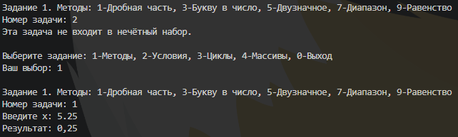

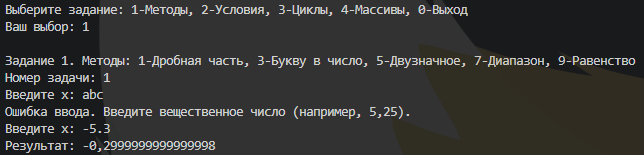

---

## Задача 3. Букву в число

### Текст задачи

Дана сигнатура метода: `public int charToNum (char x);`

Метод принимает символ х, который представляет собой один из “0 1 2 3 4 5 6 7 8 9”. Необходимо реализовать метод таким образом, чтобы он преобразовывал символ в соответствующее число. Подсказка: код символа ‘0’ — это число 48.

Пример:

```
x=’3’
результат: 3
```

### Алгоритм решения

1. Символ в C# хранится как числовой код (у `'0'` код 48, у `'1'` код 49 и т.д., коды цифр идут подряд).
2. Вычитаем из кода символа код символа `'0'`: `x - '0'`.
3. Результат (например, `'3' - '0' = 51 - 48 = 3`) возвращаем как `int`.
4. В `Main` ввод проверяется: принимается только ровно один символ от `'0'` до `'9'`.

### Тестирование

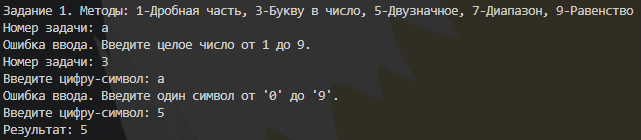

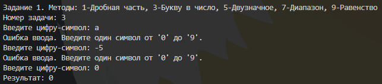

---

## Задача 5. Двузначное

### Текст задачи

Дана сигнатура метода: `public bool is2Digits (int x);`

Необходимо реализовать метод таким образом, чтобы он принимал число x и возвращал true, если оно двузначное.

Пример 1:

```
x=32
результат: true
```

Пример 2:

```
x=516
результат: false
```

### Алгоритм решения

1. Число двузначное, если его модуль находится в диапазоне от 10 до 99 включительно.
2. Проверяем два случая отдельно (чтобы не вызывать `Math.Abs` для `int.MinValue`): `x >= 10 && x <= 99` для положительных и `x <= -10 && x >= -99` для отрицательных.
3. Если выполняется любое из условий, возвращаем `true`, иначе `false`.

### Тестирование

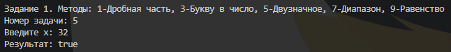

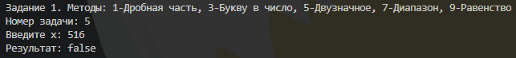

---

## Задача 7. Диапазон

### Текст задачи

Дана сигнатура метода: `public bool isInRange (int a, int b, int num);`

Метод принимает левую и правую границу (a и b) некоторого числового диапазона. Необходимо реализовать метод таким образом, чтобы он возвращал true, если num входит в указанный диапазон (включая границы). Обратите внимание, что отношение a и b заранее неизвестно (неясно кто из них больше, а кто меньше)

Пример 1:

```
a=5 b=1 num=3
результат: true
```

Пример 2:

```
a=2 b=15 num=33
результат: false
```

### Алгоритм решения

1. Так как неизвестно, какая граница больше, находим левую границу `left = Math.Min(a, b)` и правую `right = Math.Max(a, b)`.
2. Проверяем условие `num >= left && num <= right` (границы включены).
3. Возвращаем результат проверки.

### Тестирование

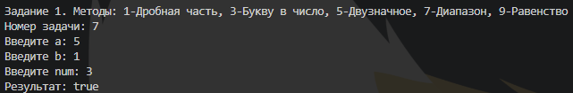

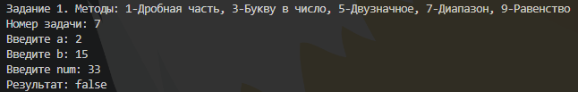

---

## Задача 9. Равенство

### Текст задачи

Дана сигнатура метода: `public bool isEqual(int a, int b, int c);`

Необходимо реализовать метод таким образом, чтобы он возвращал true, если все три полученных методом числа равны

Пример 1:

```
a=3 b=3 с=3
результат: true
```

Пример 2:

```
a=2 b=15 с=2
результат: false
```

### Алгоритм решения

1. Все три числа равны, если первое равно второму и второе равно третьему.
2. Возвращаем значение выражения `a == b && b == c`.

### Тестирование

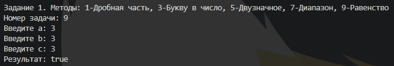

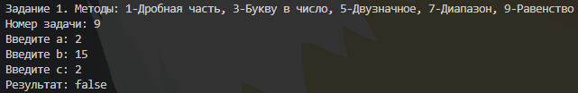

---

# Задание 2

## Задача 1. Модуль числа

### Текст задачи

Дана сигнатура метода: `public int abs (int x);`

Необходимо реализовать метод таким образом, чтобы он возвращал модуль числа х (если оно было положительным, то таким и остается, если он было отрицательным – то необходимо вернуть его без знака минус).

Пример 1:

```
x=5
результат: 5
```

Пример 2:

```
x=-3
результат: 3
```

### Алгоритм решения

1. Если `x < 0`, возвращаем `-x` (меняем знак).
2. Иначе возвращаем `x` без изменений.
3. В `Main` запрещён ввод `int.MinValue`, так как его противоположное число не помещается в `int`.

### Тестирование

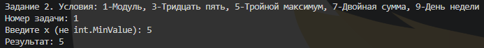

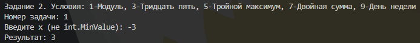

---

## Задача 3. Тридцать пять

### Текст задачи

Дана сигнатура метода: `public bool is35 (int x);`

Необходимо реализовать метод таким образом, чтобы он возвращал true, если число x делится нацело на 3 или 5. При этом, если оно делится и на 3, и на 5, то вернуть надо false. Подсказка: оператор % позволяет получить остаток от деления.

Пример 1:

```
x=5
результат: true
```

Пример 2:

```
x=8
результат: false
```

Пример 3:

```
x=15
результат: false
```

### Алгоритм решения

1. Определяем два признака: `by3 = x % 3 == 0` и `by5 = x % 5 == 0`.
2. Если число делится и на 3, и на 5 (`by3 && by5`), возвращаем `false`.
3. Иначе возвращаем `by3 || by5`: `true`, если число делится хотя бы на одно из чисел.

### Тестирование

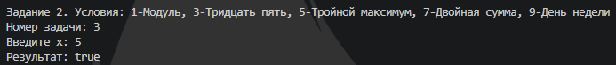

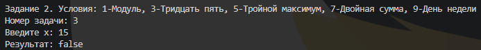

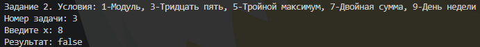

---

## Задача 5. Тройной максимум

### Текст задачи

Дана сигнатура метода: `public int max3 (int x, int y, int z);`

Необходимо реализовать метод таким образом, чтобы он возвращал максимальное из трех полученных методом чисел. Подсказка: идеальное решение включает всего две инструкции if и не содержит вложенных if.

Пример 1:

```
x=5 y=7 z=7
результат: 7
```

Пример 2:

```
x=8 y=-1 z=4
результат: 8
```

### Алгоритм решения

1. Принимаем за максимум первое число: `max = x`.
2. Если `y > max`, записываем в `max` значение `y`.
3. Если `z > max`, записываем в `max` значение `z`.
4. Возвращаем `max`. Использованы ровно две инструкции `if`, вложенных нет.

### Тестирование

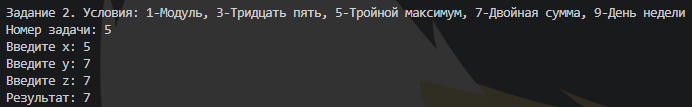

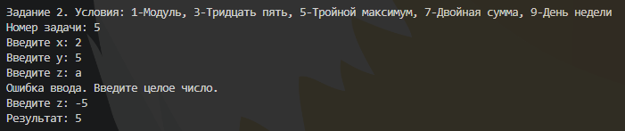

---

## Задача 7. Двойная сумма

### Текст задачи

Дана сигнатура метода: `public int sum2 (int x, int y);`

Необходимо реализовать метод таким образом, чтобы он возвращал сумму чисел x и y. Однако, если сумма попадает в диапазон от 10 до 19, то надо вернуть число 20.

Пример 1:

```
x=5 y=7
результат: 20
```

Пример 2:

```
x=8 y=-1
результат: 7
```

### Алгоритм решения

1. Вычисляем сумму `sum = x + y`.
2. Если `sum >= 10 && sum <= 19`, возвращаем `20`.
3. Иначе возвращаем `sum`.
4. В `Main` значения ограничены диапазоном `int.MinValue / 2 ... int.MaxValue / 2`, чтобы сумма не вызвала переполнение.

### Тестирование

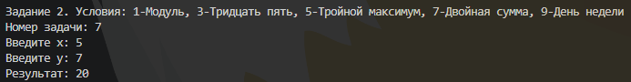

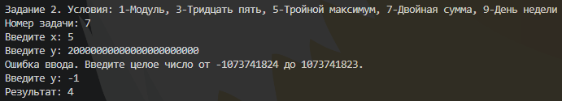

---

## Задача 9. День недели

### Текст задачи

Дана сигнатура метода: `public String day (int x);`

Метод принимает число x, обозначающее день недели. Необходимо реализовать метод таким образом, чтобы он возвращал строку, которая будет обозначать текущий день недели, где 1- это понедельник, а 7 – воскресенье. Если число не от 1 до 7 то верните текст “это не день недели”. Вместо if в данной задаче используйте switch.

Пример:

```
x=5
результат: “пятница”
```

### Алгоритм решения

1. Используем инструкцию `switch` по значению `x`.
2. Для `case 1` ... `case 7` возвращаем соответственно: «понедельник», «вторник», «среда», «четверг», «пятница», «суббота», «воскресенье».
3. В ветке `default` (число вне диапазона 1–7) возвращаем «это не день недели».

### Тестирование

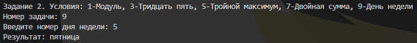

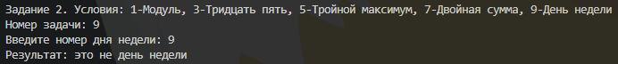

---

# Задание 3

## Задача 1. Числа подряд

### Текст задачи

Дана сигнатура метода: `public String listNums (int x);`

Необходимо реализовать метод таким образом, чтобы он возвращал строку, в которой будут записаны все числа от 0 до x (включительно).

Пример:

```
x=5
результат: “0 1 2 3 4 5”
```

### Алгоритм решения

1. Создаём `StringBuilder` для накопления результата.
2. В цикле `for` перебираем `i` от 0 до `x` включительно.
3. Перед каждым числом, кроме первого, добавляем пробел, затем добавляем само число `i`.
4. Возвращаем собранную строку.

### Тестирование

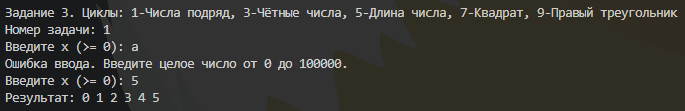

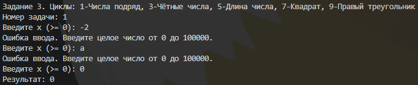

---

## Задача 3. Четные числа

### Текст задачи

Дана сигнатура метода: `public String chet (int x);`

Необходимо реализовать метод таким образом, чтобы он возвращал строку, в которой будут записаны все четные числа от 0 до x (включительно). Подсказа для обеспечения качества кода: инструкцию if использовать не следует.

Пример:

```
x=9
результат: “0 2 4 6 8”
```

### Алгоритм решения

1. Начинаем цикл `for` с `i = 0` и увеличиваем счётчик сразу на 2 (`i += 2`), поэтому в цикле встречаются только чётные числа и проверка через `if` не нужна.
2. Цикл идёт, пока `i <= x`.
3. Каждое число с пробелом добавляем в `StringBuilder`.
4. В конце удаляем лишний пробел (`TrimEnd`) и возвращаем строку.

### Тестирование

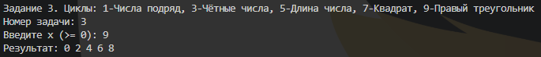

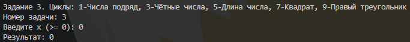

---

## Задача 5. Длина числа

### Текст задачи

Дана сигнатура метода: `public int numLen (long x);`

Необходимо реализовать метод таким образом, чтобы он возвращал количество знаков в числе x. Подсказка: `int у=123/10; // у будет иметь значение 12`

Пример:

```
x=12567
результат: 5
```

### Алгоритм решения

1. Заводим счётчик `count = 0`.
2. В цикле `do ... while` увеличиваем счётчик на 1 и делим `x` на 10 нацело (отбрасываем последнюю цифру).
3. Цикл повторяется, пока `x != 0`. Форма `do ... while` гарантирует, что для числа 0 результат будет 1.
4. Деление нацело работает и для отрицательных чисел, поэтому знак не учитывается. Возвращаем `count`.

### Тестирование

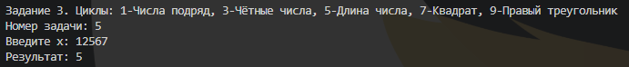

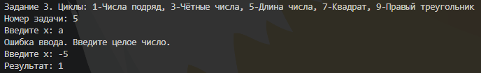

---

## Задача 7. Квадрат

### Текст задачи

Дана сигнатура метода: `public void square (int x);`

Необходимо реализовать метод таким образом, чтобы он выводил на экран квадрат из символов ‘*’ размером х, у которого х символов в ряд и х символов в высоту.

Пример 1:

```
x=2
результат:
**
**
```

Пример 2:

```
x=4
результат:
****
****
****
****
```

### Алгоритм решения

1. Внешний цикл `for` выполняется `x` раз, по одному разу на каждую строку.
2. Внутренний цикл `for` выводит `x` символов `'*'` в одну строку.
3. После внутреннего цикла выполняем переход на новую строку (`Console.WriteLine()`).

### Тестирование

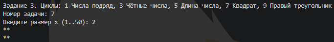

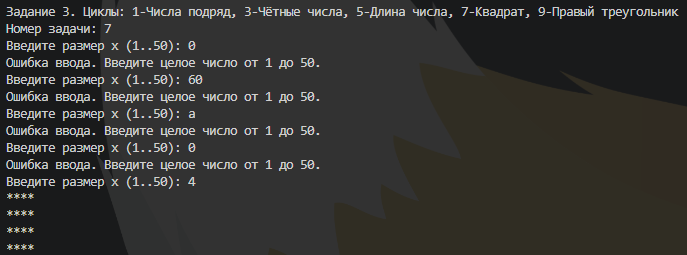

---

## Задача 9. Правый треугольник

### Текст задачи

Дана сигнатура метода: `public void rightTriangle (int x);`

Необходимо реализовать метод таким образом, чтобы он выводил на экран треугольник из символов ‘*’ у которого х символов в высоту, а количество символов в ряду совпадает с номером строки, при этом треугольник выровнен по правому краю. Подсказка: перед символами ‘*’ следует выводить необходимое количество пробелов.

Пример 1:

```
x=3
результат:
  *
 **
***
```

Пример 2:

```
x=4
результат:
   *
  **
 ***
****
```

### Алгоритм решения

1. Внешний цикл по номеру строки `i` от 1 до `x`.
2. В строке `i` сначала выводим `x - i` пробелов (первым внутренним циклом).
3. Затем выводим `i` символов `'*'` (вторым внутренним циклом).
4. После строки переходим на новую строку. Так количество звёздочек равно номеру строки, а треугольник выровнен по правому краю.

### Тестирование

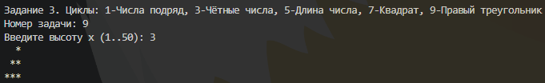

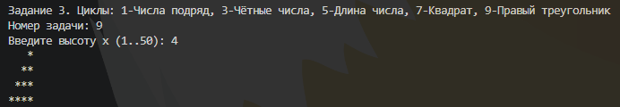

---

# Задание 4

## Задача 1. Поиск первого значения

### Текст задачи

Дана сигнатура метода: `public int findFirst (int[] arr, int x);`

Необходимо реализовать метод таким образом, чтобы он возвращал индекс первого вхождения числа x в массив arr. Если число не входит в массив – возвращается -1.

Пример:

```
arr=[1,2,3,4,2,2,5]
x=2
результат: 1
```

### Алгоритм решения

1. Проходим по массиву циклом `for` от индекса 0 до `arr.Length - 1`.
2. Если `arr[i] == x`, сразу возвращаем `i`: это первое вхождение, дальше можно не искать.
3. Если цикл закончился и число не найдено, возвращаем `-1`.

### Тестирование

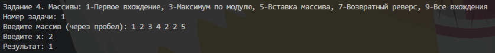

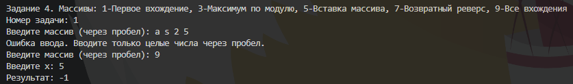

---

## Задача 3. Поиск максимального

### Текст задачи

Дана сигнатура метода: `public int maxAbs (int[] arr);`

Необходимо реализовать метод таким образом, чтобы он возвращал наибольшее по модулю (то есть без учета знака) значение массива arr.

Пример:

```
arr=[1,-2,-7,4,2,2,5]
результат: -7
```

### Алгоритм решения

1. Если массив пустой, выбрасываем исключение (`ArgumentException`), в `Main` оно перехватывается и выводится сообщение.
2. Принимаем за текущий лучший элемент `arr[0]`.
3. Проходим по остальным элементам. Если модуль элемента строго больше модуля текущего лучшего, запоминаем этот элемент. Модуль берётся от `long`, чтобы не было переполнения на `int.MinValue`.
4. Возвращаем сам элемент (со знаком), а не его модуль.

### Тестирование

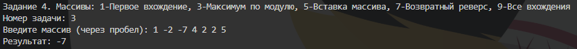

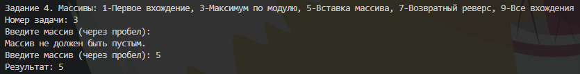

---

## Задача 5. Добавление массива в массив

### Текст задачи

Дана сигнатура метода: `public int[] add (int[] arr, int[] ins, int pos);`

Необходимо реализовать метод таким образом, чтобы он возвращал новый массив, который будет содержать все элементы массива arr, однако в позицию pos будут вставлены значения массива ins.

Пример:

```
arr=[1,2,3,4,5]
ins=[7,8,9]
pos=3
результат: [1,2,3,7,8,9,4,5]
```

### Алгоритм решения

1. Проверяем, что `0 <= pos <= arr.Length`, иначе выбрасываем исключение `ArgumentOutOfRangeException`.
2. Создаём новый массив длиной `arr.Length + ins.Length`.
3. Копируем в него элементы `arr[0 .. pos-1]` на те же позиции.
4. Копируем все элементы `ins` начиная с позиции `pos`.
5. Копируем оставшиеся элементы `arr[pos ..]` со сдвигом на `ins.Length`.
6. Возвращаем новый массив, исходные массивы не изменяются.

### Тестирование

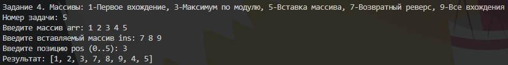

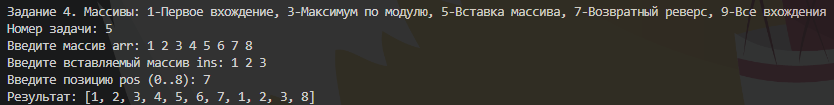

---

## Задача 7. Возвратный реверс

### Текст задачи

Дана сигнатура метода: `public int[] reverseBack (int[] arr);`

Необходимо реализовать метод таким образом, чтобы он возвращал новый массив, в котором значения массива arr записаны задом наперед.

Пример:

```
arr=[1,2,3,4,5]
результат: [5,4,3,2,1]
```

### Алгоритм решения

1. Создаём новый массив `result` такой же длины, как `arr`.
2. В цикле по `i` от 0 до `arr.Length - 1` записываем `result[i] = arr[arr.Length - 1 - i]`.
3. Возвращаем `result`, исходный массив остаётся без изменений.

### Тестирование

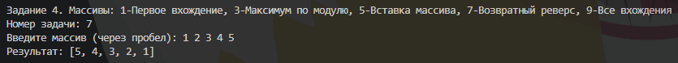

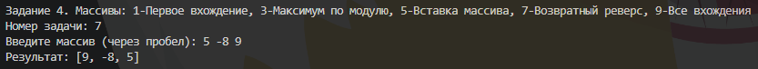

---

## Задача 9. Все вхождения

### Текст задачи

Дана сигнатура метода: `public int[] findAll (int[] arr, int x);`

Необходимо реализовать метод таким образом, чтобы он возвращал новый массив, в котором записаны индексы всех вхождений числа x в массив arr.

Пример:

```
arr=[1,2,3,8,2,2,9]
x=2
результат: [1,4,5]
```

### Алгоритм решения

1. Первым проходом по массиву подсчитываем количество элементов, равных `x` (это длина результата).
2. Создаём массив `result` нужной длины.
3. Вторым проходом по массиву записываем в `result` индексы `i`, для которых `arr[i] == x`.
4. Возвращаем `result`. Если вхождений нет, возвращается пустой массив.

### Тестирование

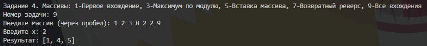

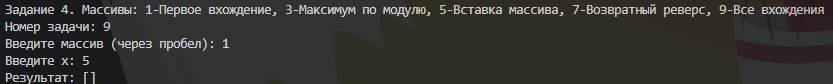